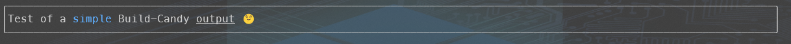

# Build-Candy

```Build-Candy``` is the fundation function that renders an ANSI string based on a tag-formated input.

The syntax is :

```powershell
Build-Candy -Text $text 
  [-width $width] 
  [-Border "Normal|Rounded|Block|OuterHalf|InnerHalf|Thick|Double|Hidden"]
  [-Align Left|Center|Right]
  [-Fullscreen]
```

The ```Text``` parameter is mandatory.  It can be passed through the pipe.

Every other parameter is optionnal.

```Width``` parameter indicates the wanted width of the generated string.
if ```Fullscreen``` is used along with ```Width```, ```Fullscreen``` will have the priority.

```Border``` parameter sets the border type that will be drawn around the result string.  It can be one of the following list :

 *"Normal", "Rounded", "Block", "OuterHalf" , "InnerHalf", "Thick", "Double", "Hidden"*


```Fullscreen``` is a switch parameter.  It's presence indicates that the output will take the whole screen width.

```Align``` parameter takes a value from an Enum, which can have ```Left, Center or Right``` as value.  As the name suggest, it will align the output accordingly to the choosen direction.

```Build-Candy``` will return a formatted string.  Although it can be outputted to the terminal, the purpose of this function is to build a buffer that will be printed afterwards. (eg, with ```Write-Candy```)

```Build-Candy``` can output a multiline formatted string.  
To produce multi-lines output, simply add "`n" where the string needs to be splitted.  
When using multi-lines output in one ```Build-Candy``` call, the optionnal parameters are applied to each line and are the same.  
To produce a multi-line output, with distinct formatting per line, one have to build a string using multiple ```Build-Candy``` calls (Examples below)

## **Examples**

### Single lines

```powershell
Build-Candy "Test of a simple Build-Candy output"
```

Result :  
 

```powershell
Build-Candy "Test of a <75>simple</75> Build-Candy output"
```

Result :  


```powershell
Build-Candy "Test of a <75>simple</75> Build-Candy <U>output</U> 🌝"
```

Result :  


```powershell
Build-Candy "Test of a <75>simple</75> Build-Candy <U>output</U> 🌝" -fullscreen
```

Result :  

```powershell
Build-Candy "Test of a <75>simple</75> Build-Candy <U>output</U> 🌝" -fullscreen -border "Rounded"
```

Result :  

```powershell
Build-Candy "Test of a <75>simple</75> Build-Candy <U>output</U> 🌝" -fullscreen -border "Rounded" -Align Center
```

Result :  


### Multi-line (Single function call)

```powershell
Build-Candy "Test of a simple Build-Candy output`nOn two lines"
```

*Result :*  


```powershell
Build-Candy "Test of a <75>simple</75> Build-Candy output`n<Red>On two lines</Red>"
```

*Result :*  


```powershell
Build-Candy "Test of a <75>simple</75> Build-Candy <U>output</U> 🌝`nOn <R>two</R> <U>lines</U>" -Align Center -fullscreen
```

*Result :*  


Using splatting for lisibility :  
```powershell
$buffer = "Test of a <75>simple</75> Build-Candy <U>output</U> 🌝`nOn <R>two</R> <U>lines</U>"
$format = @{
    Border = "Thick"
    Align = "Center"
    fullscreen = $true
}
$text = Build-Candy $buffer @format

Write-Host $text
```

*Result :*  


### Multi-lines (Multiple function calls)

```powershell
$text = Build-Candy "This is the first line"  -width 60
$text += "`n" + (Build-Candy "This is the second line" -width 60 -align Right)

Write-Candy $text -Border "Rounded" -width 60
```

*Result :*  


```powershell
$params =@{
    width = 80
}
$text = Build-Candy "This is <57>the first</57> line"  -Align Center @params
$text += "`n" + (Build-Candy "This is <190><U>the second</U></190> line" -Align Left   @params)
$text += "`n" + (Build-Candy "🎉 This is <I>>the <219>third</219> line</I> 🎉" -Align Right   @params)

Write-Candy $text -Border "Rounded" @params
```

*Result :*  


```powershell
$params =@{
    fullscreen = $true
}
$text = Build-Candy "This is <57>the first</57> line"  -Align Center @params
$text += "`n" + (Build-Candy "This is <190><U>the second</U></190> line" -Align Left   @params)
$text += "`n" + (Build-Candy "🎉 This is <I>>the <219>third</219> line</I> 🎉" -Align Right   @params)

Write-Candy $text -Border "Double" @params 
```

*Result :*  


