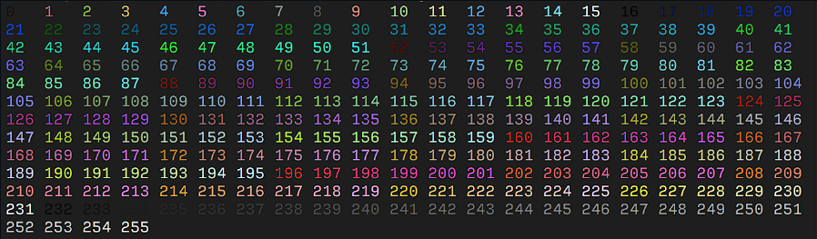

### Formatting tags

psCandy is a "tag" based library that renders colorfull output in the terminal.

There a several tag types :

## Color Tags

The color tags can be 8 or 16 bits.

### 8 bits colors

8 bits tags are the basic ANSI color codes from 0 to 255.



To specify an 8bit color code, simply enclose the number in the opening and closing tags.

Example :

```powershell
  Build-Candy "<4>This is a blue String</4>"
```

Result : 

The "<>" tags are used to specify the foreground color where "[]" are used to fix the background color of the enclosed string.

Example :

```powershell
  Build-Candy "<4>[195]This is a blue String[/195]</4>"
```

Result : 

The foreground ("<>") and background ([]) tags can be used anywhere in the string that as to be formatted.
There is also no particular order between foreground and background.
An opening tag is where the formatting begins and a closing tag is where it ends.

The **only** requirement is to **always** close an open tag.

This example is valid :

```powershell
  Build-Candy "<4>This is a blue [195]on white</4> <55> and purple</55>[/195] string"
```

The result will be : 

### 16 bits colors

The 16 bits colors are named colors, that came originally from ```[System.Drawing.Color]```

As I wanted to keep the module Powershell 5.1 compatible, I made a class that returns every RGB values that correspond to the colors from ```[System.Drawing.Color]```.

The complete list of the 16 bits colors can be obtained with a static method of the ```[Color]``` class.

An helper exists to select the color and copy it in the clipboard.

```powershell
  Select-Color [-clipboard]
```


If ```Select-Color``` is used with the ```-clipboard``` parameter, the name of the color will be copied in the clipboard and one can easily paste the name in a formatting tag.

*Remark* : The ```Select-Color``` function uses the ```[List]``` class of psCandy.  Therefore, the incremental search is available to filter the colors.


The 16 bits color tags work exactly the same way that 8 bits do.

The foreground tags are "<>" and the background ones are "[]".

So, here is an example of 16 bits tags :

```powershell
  Build-Candy "<DodgerBlue>This is a DodgerBlue string</DodgerBlue>"
```

The result is 

The 8 and 16 bits colors can be mixed, for the foreground and/or the background.

```powershell
Build-Candy "<200>8bit color [Beige] on a 16bit Background [/Beige]</200>"
```

Will return : 

## Style Tags

In addition to colors, one can add style tags to the string.

Styles tags come in two forms : Long and Short.

|Style|Long|Short|
|-----|----|-----|
|Underline|\<Underline\>|\<U\>|
|Bold|\<Bold\>|\<B\>|
|Italic|\<Italic\>|\<I\>|
|Strike|\<Strike\>|\<S\>|
|Reverse|\<Reverse\>|\<R\>|

As for the 8/16 bits color tags, the style tags forms can be mixed.

The **only** requierement is to close a that that has been opened.

Of course, Style and Color tags can be used together.

The Style tags have a feature that Color tags don't have : They can be imbricated.

```powershell
Build-Candy "<200>8bit <S><I>Italic color</I></S> [Beige] on a 16bit <Underline>Background</Underline> [/Beige]</200>"
```

Will produce : 
