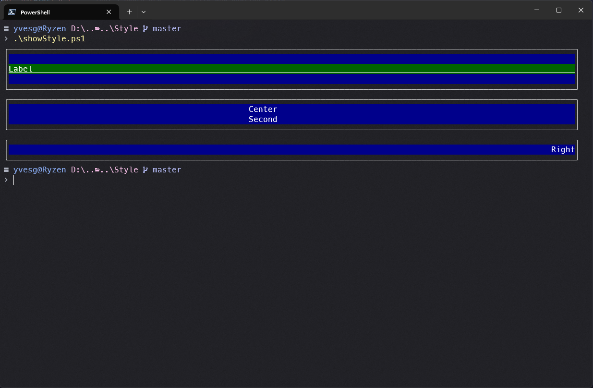
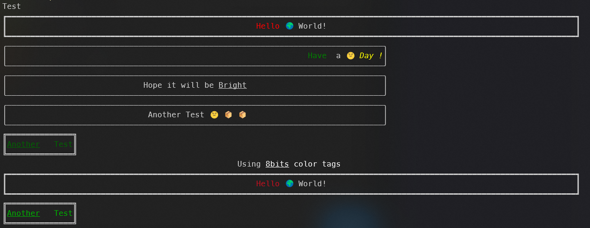

# psCandy


A Powershell Module to produce eye-candy outputs in the terminal.

I used Charmbracelet/gum to enhance my powershell scripts, but some limitations / behaviours made it difficult to use for me.

So I decided to write my own visual library, 100% in powershell.

To install, use

```Powershell
  Install-module -Name psCandy -Scope CurrentUser
```

**5 classes are enable :**

- Color
- Spinner
- List
- Confirm
- Style
- Pager (in progress)

**Functions :**

- Write-Candy (inspired from https://github.com/SwissPowershell/SPS-Host)

Here is little demo https://youtu.be/WHrmqjLkMSM

## Color

The class provides 2 static metods :

- Color16
- ColorRBG

### Color16

```Powershell
  [Color]::Color16([String]$text,[Int]$ForegroundColor,[Int]$BackgroundColor,[Switch]$Underline,[Switch]$Strike)
```

This function returns a string with ansi codes to format the text passed to the function.

The function will apply formatting based on the available parameters

Here is a table with the color values accepted by the function


Examples :

```Powershell
[color]::color16("this is a test",45,-1,$false,$false)
```

Result :


```Powershell
[color]::color16("this is a test",127,-1,$true,$false)
```

Result :


```Powershell
[color]::color16("this is a test",88,188,$true,$false)
```

Result :


### ColorRGB

```Powershell
[color]::colorRGB ([string]$Text,[System.Drawing.Color]$Foreground,[System.Drawing.Color]$Background,[switch]$Underline,[switch]$Strike)
```

Similar to the Color16 function, but takes 2 [System.Drawing.Color] in parameters.
The output is pretty mych the same, except that it's not limiter to 256 colors.

Examples :

```Powershell
[color]::colorRGB("This is a RGB Test",[System.Drawing.Color]::DarkViolet,[System.Drawing.Color]::Empty,$False,$False)
```

Result :


***
But the real deal is when the class is instanciated.
The Render method, like the name suggests, reders an ansi colored string.

```Powershell
  $DeepPink = [Color]::new([System.Drawing.Color]::DeepPink)
  $DeepPink.render("Test from Object")
```

Result :


In addition, styles can be modified .....

```Powershell
  $DeepPink.style = [Styles]::Underline
  $DeepPink.render("Test from Object Underline :)")
```

Result :


Styles can be mixed :

```Powershell
  $DeepPink.style = ([Styles]::Underline -bor [Styles]::Strike)
  $DeepPink.render("Test from Object Underline and strike :)")
```

Result :


This method is geat to build a theme for your scripts.
This is how the other classes of the module use the [color] Classe.

## List

The list class is a generic list component that takes a [System.Collections.Generic.List[ListItem] in input and displays the items in a pretty way.

```Powershell
  [ListItem]
```

Is a class that allows [List] to display and processes the list.

[ListItem] has 4 constructor overloads :

```Powershell
  ListItem([string]$text,[PSCustomObject]$value)
```

The simpliest.  Create a [ListItem] with only a [string]$Text and a [PSCustomObject]$Value.
Even the $Value can be $null.

```Powershell
ListItem([string]$text,[PSCustomObject]$value,[string]$Icon)
```

This constructor allows the use of an icon that will be draw at the beginning of the line.

Example :

```Powershell
using module psCandy
. .\themes.ps1

[Console]::OutputEncoding = [System.Text.Encoding]::UTF8 
$items = [System.Collections.Generic.List[ListItem]]::new()
$items.Add([ListItem]::new("Banana", 1,"🍌"))
$items.Add([ListItem]::new("Apple", 2, "🍎"))
$items.Add([ListItem]::new("Mandarine", 3, "🍊"))
$items.Add([ListItem]::new("Grape Fruit", 4, "🟠"))
$items.Add([ListItem]::new("Grape Fruit(too)", @{"aString"="Test"; "aBool"=$true}, "🟠"))
$items.Add([ListItem]::new("Potato", 5,"🥔"))
$items.Add([ListItem]::new("Potato 2", 6,"🥔"))
$items.Add([ListItem]::new("Potato 3", 7,"🥔"))
$items.Add([ListItem]::new("Potato 4",8,"🥔"))
$items.Add([ListItem]::new("Potato 5", 9,"🥔"))
$items.Add([ListItem]::new("Banana 2", 10,"🍌"))
$items.Add([ListItem]::new("Apple 2", 11,"🍎"))
$items.Add([ListItem]::new("Mandarine 2", 12,"🍊"))
$items.Add([ListItem]::new("Grape Fruit 2", 13,"🟠"))
$items.Add([ListItem]::new("Potato 6", 14,"🥔"))

$list = [List]::new($items)  
$list.LoadTheme($Theme)
$list.SetHeight(10)
# $list.SetLimit($True)
$list.Display()
```

Result :


**Remark**
The [ListItem] can contain mixed return value types.

Example :

```Powershell
using module psCandy


[Console]::OutputEncoding = [System.Text.Encoding]::UTF8 
$items = [System.Collections.Generic.List[ListItem]]::new()
$items.Add([ListItem]::new("Banana", 1,"🍌"))
$items.Add([ListItem]::new("Apple", 2, "🍎"))
$items.Add([ListItem]::new("Mandarine", 3, "🍊"))
$items.Add([ListItem]::new("Grape Fruit", 4, "🟠"))
$items.Add([ListItem]::new("Grape Fruit(too)", @{"aString"="Test"; "aBool"=$true}, "🟠"))
$items.Add([ListItem]::new("Potato", 5,"🥔"))
$items.Add([ListItem]::new("Potato 2", 6,"🥔"))
$items.Add([ListItem]::new("Potato 3", 7,"🥔"))
$items.Add([ListItem]::new("Potato 4",8,"🥔"))
$items.Add([ListItem]::new("Potato 5", 9,"🥔"))
$items.Add([ListItem]::new("Banana 2", 10,"🍌"))
$items.Add([ListItem]::new("Apple 2", 11,"🍎"))
$items.Add([ListItem]::new("Mandarine 2", 12,"🍊"))
$items.Add([ListItem]::new("Grape Fruit 2", 13,"🟠"))
$items.Add([ListItem]::new("Potato 6", 14,"🥔"))

$list = [List]::new($items)  
$list.SetHeight(10)
# $list.SetLimit($True)
$list.Display()

```

Result :


```Powershell
ListItem([string]$text,[PSCustomObject]$value,[string]$Icon,[System.Drawing.Color]$Color)
```

This constructor takes a 4th parameter : The rendering color of the [ListItem]

Example :

```Powershell
using module psCandy

param (
  [string]$Path = "..\"
)

[Console]::OutputEncoding = [System.Text.Encoding]::UTF8 

function getDirContent {
  param(
    [string]$path
  )
  $items = [System.Collections.Generic.List[ListItem]]::new()
  $items.Add([ListItem]::new("..", $path))
  Get-ChildItem -Path $path -File  | ForEach-Object {
    $Name = $_.Name
    $items.Add([ListItem]::new($Name, $_,"📄",[System.Drawing.Color]::Green))
  }
  Get-ChildItem -Path $path -Directory  | ForEach-Object {
    $Name = $_.Name
    $items.Add([ListItem]::new($Name,$_, "📂", [System.Drawing.Color]::OrangeRed))
  }
  return $items
}

$items = getDirContent -path $Path
$result = $null
if ($theme) {
  $Theme.list.SelectedColor = [System.Drawing.Color]::yellow
}
while ($true) {
  $List = [List]::new($items)
  $list.SetHeight(15)
  $list.SetLimit($True)
  $choice = $List.Display()
  if ($choice) {
    if ($choice.text -eq "..") {
      $p = [System.IO.Path]::GetDirectoryName($choice.Value)
    }
    else {
      if (Test-Path -Path $choice.Value.FullName -Type Container) {
        if ($choice.chained) {
          $result = $choice.Value
          break
        } else {
          $p = $choice.Value.FullName
        }
      }
      else {
        $result = $choice.Value
        break
      }
    }
    $items = getDirContent -path $p
    $List.setItems($items)
  }
  else {
    break
  }
}
$result
```

Result :


In this "mini" *functionnal* file explorer, the files are redered in green, with a icon "📄" and the Folders are in Orange with an icon "📂"

```Powershell
ListItem([string]$text,[PSCustomObject]$value,[System.Drawing.Color]$Color)
```

This last constructor only take a [ListItem] color, but no icon.

Example :

```Powershell
using module psCandy
. .\themes.ps1


[Console]::OutputEncoding = [System.Text.Encoding]::UTF8 
$items = [System.Collections.Generic.List[ListItem]]::new()
[system.Drawing.color] | Get-Member -Static -MemberType Properties | ForEach-Object {
  
  [psCustomObject]$color = [color]::new([System.Drawing.Color]::"$($_.Name)")
  $colorName = $_.Name
  $items.Add([ListItem]::new($colorName, $color,[System.Drawing.Color]::"$($_.Name)"))
}
$List = [List]::new($items)
$List.LoadTheme($Theme)
$list.SetHeight(25)
$List.Display()
```

Result :


## Spinner

The Spinner is a class than can display an animated spinner while performing long tasks.
There are 7 styles of Spinners (Circle,Dots,Line,Square,Bubble,Arrow,Pulse).  By default, "Dots" is used.
The Spinner can be "themed" with the [Color] class.

Example :

```Powershell
using module psCandy

("Circle","Dots","Line","Square","Bubble","Arrow","Pulse") | ForEach-Object {
  $spinner = [Spinner]::new($_)
  $spinner.Start("$($_) Testing Spinner for 5 seconds ...")
  start-sleep -Milliseconds 5000
  
  $Spinner.Stop()
} 
```

Result :


## Confirm

The [Confirm] component is a simple confirmation component.
It takes an array of [Option] in input as well as a [String]Title.

[Option] Has 2 constructor overloads :

```Powershell
Option([String]$text,[PSCustomObject]$value)
```

Where [String]$Text is the label of the option and [PSCustomObject]$Value is the associated value that will be returned if the option is choosen.

```Powershell
Option([String]$text,[PSCustomObject]$value,[bool]$selected)
```

The [Bool]$Selected parameter is added to tell that this option is the selected default.

If no [Option] has a Selected parameter, the first option of the array will be the default.

Exammple :

```Powershell
using module psCandy

$options = @(
  [Option]::new("Yes", "Yes"),
  [Option]::new("No", "No",$true),
  [Option]::new("Maybe", "?")
)
$confirm = [Confirm]::new("Do you want to continue?",$options,$true)
[console]::Clear()
$result = $confirm.Display()
[console]::WriteLine()
switch ($result.value) {
  "Yes" {
    Write-Host "You chose Yes"
  }
  "No" {
    Write-Host "You chose No"
  }
  "?" {
    Write-Host "You chose Maybe"
  }
  default {
    Write-Host "You chose nothing"
  }
}

```

Result :


Now, psCandy supports "Theming".
Here is an example of Theme file :

```Powershell
using module psCandy

$Theme = @{
  "list"= @{
    "SearchColor" = "BlueViolet"
    "SelectedColor" = "Yellow"
    "SelectedStyle" = [Styles]::Underline
    "FilterColor" = "Orange"
    "NoFilterColor" = "Orange"
    "FilterStyle" = [Styles]::Underline
    "Checked"="◉"
    "Unchecked"="○"
  }
  "spinner" = @{
    "spincolor"= "MediumOrchid"
    "spinType"= "Dots"
  }
  "choice" = @{
    "SelectedForeground" = "BlueViolet"
    "SelectedBackground" = "White"
    "OptionColor" = "SkyBlue"
    "MessageColor" = "IndianRed"
  }
}
```

And Here is the "Confirm" example, with the Theme loaded :

```Powershell
using module psCandy

. .\themes.ps1

$options = @(
  [Option]::new("Yes", "Yes"),
  [Option]::new("No", "No",$true),
  [Option]::new("Maybe", "?")
)
$confirm = [Confirm]::new("Do you want to continue?",$options,$true)
[console]::Clear()
$result = $confirm.Display()
[console]::WriteLine()
switch ($result.value) {
  "Yes" {
    Write-Host "You chose Yes"
  }
  "No" {
    Write-Host "You chose No"
  }
  "?" {
    Write-Host "You chose Maybe"
  }
  default {
    Write-Host "You chose nothing"
  }
}
```

Result :

)

*The "Theme" part is still experimental and may probably change in the future, using a JSON / YAML format.*

## Style

The [Style] component allows to render text with colors, styles, alignment and borders.
There is one constructor, that accept a [String]$Text.

```Powershell
Style([string]$text)
```

Every other parameters are set by some setters.

### The setters :

- SetColor (2 overloads)

```Powershell
SetColor([System.Drawing.Color]$Foreground,[System.Drawing.Color]$Background)
```

This overload sets the Foreground **and** the Background

```Powershell
SetColor([System.Drawing.Color]$Foreground)
```

This overload sets only the Foreground

- SetStyle
  
```Powershell
SetStyle([Styles]$style)
```

This method sets the Style of the label (Normal,Underline,Bold,Reversed,Strike).
These values can be combined.

- SetBorder
  
```Powershell
SetBorder([bool]$border)
```

This method sets the border drawing (True or False)

- SetAlign
  
```Powershell
setAlign([Align]$align)
```

This method sets the alignment of the text. The possibles values are Left,Center or Right

- SetLabel
  
```Powershell
SetWidth([int]$width)
```

This methods override the text to be redered.

-SetWidth

```Powershell
  SetWidth([int]$width)
```

This method changes the width of the redered text.  By default, it's set to screen width.

Example :

```Powershell
using module psCandy

$label = [Style]::new("Label")
$Label.SetColor([System.Drawing.Color]::White, [System.Drawing.Color]::DarkGreen)
$Label.SetStyle([Styles]::Underline)
$lbl = $Label.Render()
$Style = [Style]::new("`n$($lbl)`n")
# $Style.SetStyle([Styles]::Underline)
$Style.SetBorder($true)
$Style.SetColor([System.Drawing.Color]::White, [System.Drawing.Color]::DarkBlue)
$Style.setAlign([Align]::Left)
$Style.Render()
$Style.SetLabel("Center`nSecond")
$Style.setAlign([Align]::Center)
$Style.Render()
# $Style.SetWidth(50)
$Style.SetLabel("Right")
$Style.setAlign([Align]::Right)
$Style.Render()
```

Result :



## Write-Candy
This is a function that output string, using tags to format the output.

Example :

```Powershell
Write-Candy "Test"
Write-Candy "<Red>Hello</Red> 🌍 World!" -width ($Host.UI.RawUI.BufferSize.Width -2) -Align Center -Border "Thick"
Write-Candy "<Green><Bold>Have</Bold></Green>  a 🌝 <Italic><Yellow>Day !</Yellow></Italic>" -width 80 -Align Right -Border "Rounded"
Write-Candy "Hope it will be <Underline>Bright</Underline>" -width 80 -Align Center -Border "Rounded"
Write-Candy "Another Test 🌝 📦 📦" -width 80 -Align Center -Border "Rounded"
Write-Candy "<DarkGreen><Underline>Another</Underline>   Test</DarkGreen>" -Border "Double"
```

The function accept the parameter from the pipe.

Result :



*Remark :*
For know, the **styles** tags cannot be combined, this will be possible in a future version.